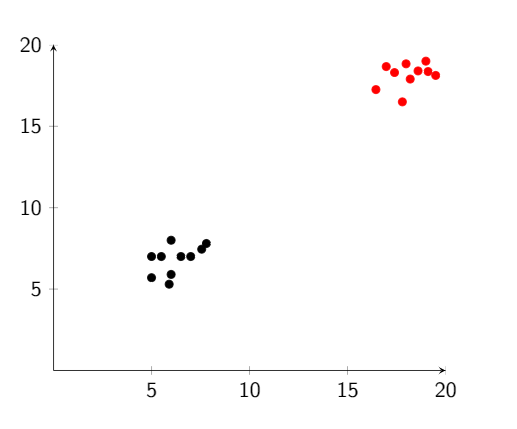
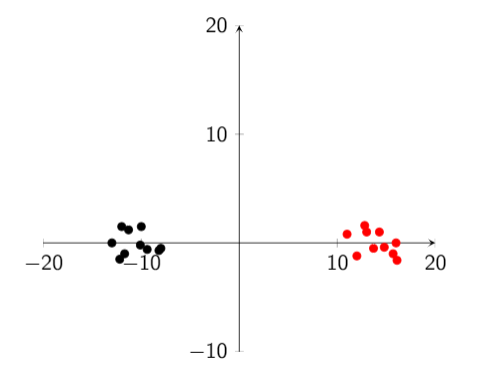
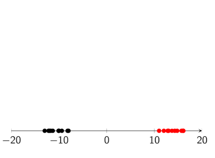

Unsupervised learning
=====================

Type of machine learning which finds specific relations based on dataset provided before. Data applied to unsupervised learning do not have labels - it means when we are testing model and giving observation to the model, we will not get any feedback about matched label.

### Unsupervised learning's methods:
* clustering - division of observations into classes which have similar values of attributes to sort dataset out and to notice common qualities which will simplify group classification,

* principal component analysis - reduction in dimensions of dataset while losing possibly least amount of information simultaneously.

#### Stages of PCA:
* determining principal components. First is line which fits the data best - distances between this line and data points (blue lines on plot) are minimal. Second principal component is perpendicular to the first one,

* applying principal components as new axis of coordinate system,

* reduction in y-dimension whose information about the data are less valuable than x-dimension's.

##### Reliable sources:
* [Wikipedia](https://en.wikipedia.org/wiki/Unsupervised_learning),
* [Towards Data Science](https://towardsdatascience.com/unsupervised-learning-and-data-clustering-eeecb78b422a).
